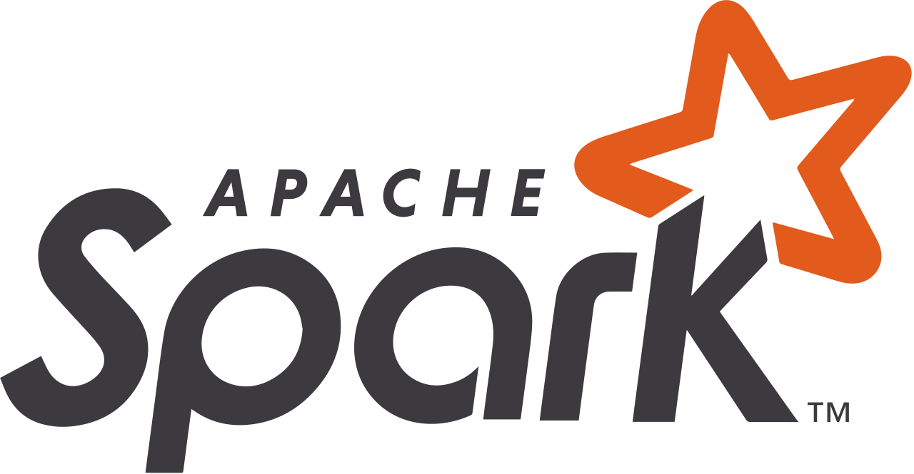
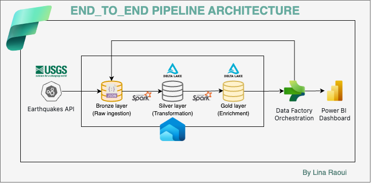
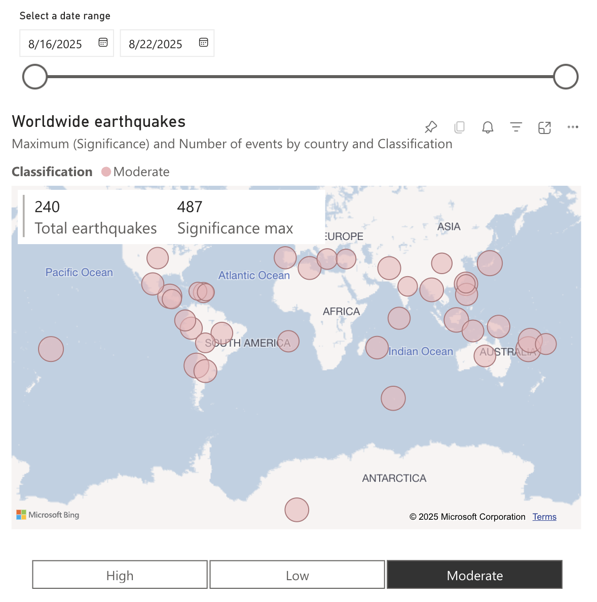
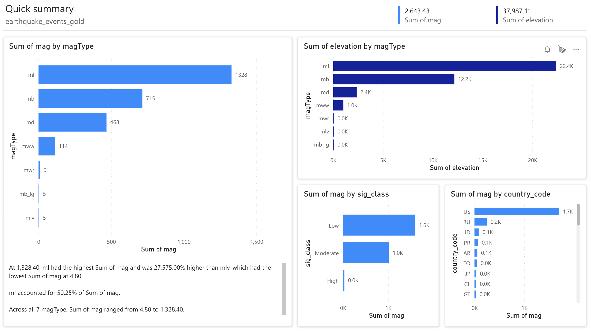
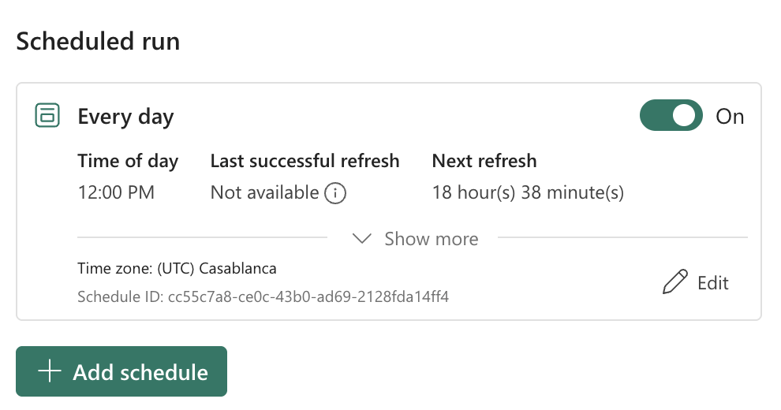

# Earthquake Data Engineering with Microsoft Fabric  

## Project Overview  

This project demonstrates how to build a data pipeline using Microsoft Fabric following the Medallion Architecture.
The pipeline ingests earthquake data from an external API, processes it through structured layers (Bronze, Silver, Gold) and delivers interactive insights via Power BI.

By the end of this project, raw data will be transformed into actionable insights—ready for analysis, reporting or decision-making.

  

> **Note:** This project was conducted following [Pathfinder Analytics’](https://www.youtube.com/@pathfinderanalytics) YouTube tutorial as a guided learning exercise.  

## Business Relevance

Earthquake data is critical for governments, research institutes, and insurance companies. Having timely and well-structured information helps:
- Plan emergency responses.
- Assess and mitigate seismic risks.
- Support data-driven decision-making.

This project automates the flow of data so stakeholders always have the latest, cleaned and enriched earthquake data without manual effort.

## Tools & Technologies  
- **Microsoft Fabric**  
  - Workspaces & Lakehouse  
  - Data Factory Pipelines (orchestration)  
  - Notebooks (PySpark, Python)  
  - Semantic Models & Power BI Reports  
- **Python** (Requests, Pandas, PySpark)  
- **USGS Earthquake API** (data source)

  
  
  
  
  
  

 

---

## Architecture / Workflow  
We use Microsoft Fabric’s ecosystem to design an end-to-end pipeline:

  

 

1.	Bronze Layer (Raw Ingestion)
    -	Stores raw earthquake data exactly as received from the API.
    -	Ensures auditability and source-of-truth preservation.
2.	Silver Layer (Transformation)
    -	Converts raw JSON into Delta Tables.
    -	Cleans and structures the data (time, magnitude, location, etc.).
    -	Provides a ready-to-use dataset for standard reporting.
3.	Gold Layer (Enrichment)
    -	Adds enriched attributes such as country codes and significance classifications.
    -	Produces a curated dataset optimised for analytics.
4.	Power BI Dashboard
    - Connects to the Gold Layer to create interactive reports.
    - Visualises trends such as earthquakes by region, magnitude distributions, and temporal patterns.
5.	Data Factory Orchestration
    -	Automates the pipeline with daily refresh schedules.
    -	Guarantees fresh and reliable data availability. 

---

## 📊 Example Dashboards

  
  

## How It Works
1.	Data is ingested daily from the earthquake API into the Bronze Layer.
2.	Transformation scripts structure and clean the data into the Silver Layer.
3.	Additional enrichment logic builds the Gold Layer dataset.
4.	Power BI automatically refreshes to visualise the enriched data.

## Automation

The entire pipeline is orchestrated with Microsoft Fabric Data Factory, which:
- Triggers the pipeline on a daily schedule.
- Ensures that ingestion, transformation, and enrichment happen seamlessly.
- Delivers always up-to-date insights to Power BI.

  

## Learning Context

This project was built by following a Microsoft Fabric tutorial and then customised into a hands-on project.
It demonstrates how to apply medallion architecture principles in practice while gaining real-world experience with Fabric.

#### Outcomes
- Built an end-to-end automated data pipeline.
-	Learned how to implement the Bronze, Silver, Gold layered approach.
-	Created a Power BI dashboard for meaningful earthquake insights.

### Notes
This project was developed using the 60-day free trial of Microsoft Fabric, which provided access to Data Engineering, Data Factory, and Power BI features.
