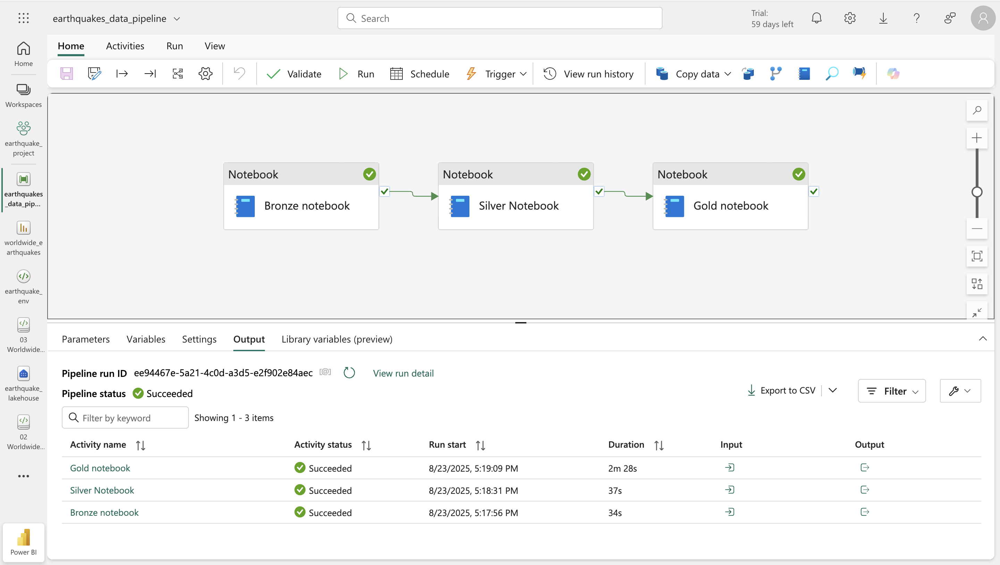

# Earthquake Data Engineering with Microsoft Fabric  

## Project Overview  
This project demonstrates how to build a complete **data lakehouse solution** in **Microsoft Fabric**, using real-time earthquake data from the **USGS Earthquake API**.  
The goal was to design an **end-to-end pipeline** for ingesting, transforming, and analyzing seismic data, and then presenting insights through **Power BI dashboards**.  

> **Note:** This project was conducted following [Pathfinder Analytics’](https://www.youtube.com/@pathfinderanalytics) YouTube tutorial as a guided learning exercise.  

---

## Tools & Technologies  
- **Microsoft Fabric**  
  - Workspaces & Lakehouse  
  - Data Factory Pipelines (orchestration)  
  - Notebooks (PySpark, Python)  
  - Semantic Models & Power BI Reports  
- **Python** (Requests, Pandas, PySpark)  
- **USGS Earthquake API** (data source)  

---

## Architecture / Workflow  
1. **Data Ingestion**  
   - Connected to the **USGS Earthquake API** using Python Requests.  
   - Stored raw data in the **Bronze layer** of the lakehouse.  

2. **Data Processing**  
   - **Bronze → Silver**: Cleaned and structured the raw JSON.  
   - **Silver → Gold**: Aggregated and enriched the dataset for reporting.  
   - Used **Fabric notebooks (PySpark)** for transformation.  

3. **Data Orchestration**  
   - Built a **Data Factory pipeline** to automate ingestion & transformations.  

4. **Visualization**  
   - Updated the **Default Semantic Model** in Fabric.  
   - Designed a **Power BI report** to visualize earthquake frequency, magnitude distribution, and regional impact.  

---

## Screenshots  
### Fabric Pipeline  
  

### Power BI Dashboard  
  

---

## How to Reproduce  
1. Create a **Microsoft Fabric workspace**.  
2. Set up a **Lakehouse**.  
3. Run the notebooks in order: Bronze → Silver → Gold.  
4. Orchestrate using a **Data Factory pipeline**.  
5. Connect the semantic model to **Power BI** for reporting.  

---

## Learnings  
- Hands-on experience with **Lakehouse architecture** (Bronze/Silver/Gold layers).  
- Built **end-to-end orchestration** using Fabric Pipelines.  
- Learned how to connect **real-world API data** to Fabric.  
- Designed a **semantic model and Power BI dashboards** for insights.  

---

### Notes
This project was developed using the 60-day free trial of Microsoft Fabric, which provided access to Data Engineering, Data Factory, and Power BI features.
